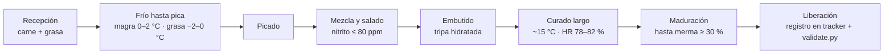

# Procedimiento de embutido crudo-curado

SOP del taller para salame / chorizo seco. El flujo actual es **curado largo
a ~15 °C, HR 78–82 %, sin fase de fermentación acelerada**. Las bacterias
lácticas trabajan lento durante todo el curado; la seguridad se apoya en
nitrito ingoing, cadena de frío, merma y tiempo, no en un pico de acidez.

Referencias: barreras de inocuidad en [[barreras-control]], marco normativo
del nitrito en [[normativa-eu-2023-2108]], y la nota histórica sobre
fermentación acelerada en [[fermentacion-referencia]] (no se aplica en este
procedimiento).

## 0. Flujo del proceso

## 1. Insumos y recepción

- **Carne magra**: preferido paleta de cerdo. Recepción a ≤ 4 °C, sin olores
  extraños ni exudado excesivo. Retirar tendones y ganglios visibles.
- **Grasa**: preferido papada (más firme) o dorsal. Blanca, sin ranciedad.
- **Ratio típico**: 70 % magro / 30 % grasa (ajustable por receta).
- **Sal común**: 25–28 g/kg de masa total.
- **Sal de cura (nitrito de sodio)**: dosificar para **≤ 80 ppm ingoing** sobre
  masa total. Pesar en balanza de precisión (± 0,1 g); el nitrito no se estima
  "a ojo".
- **Especias**: pesar por receta, mezclar en seco antes de incorporar.
- **Tripa**: natural (calibre por receta) o colágeno. Hidratación mínima **30
  min en agua tibia con un chorro de vinagre o vino blanco** antes de embutir.

## 2. Cadena de frío (crítico)

| Momento | Temperatura objetivo | Máx. fuera de frío |
|---|---|---|
| Cámara / heladera de reposo antes de picar | 0–2 °C | — |
| Magra al pasar por la picadora | **0–2 °C** | 15 min |
| Grasa al pasar por la picadora | **−2 a 0 °C** (semi-congelada) | 15 min |
| Masa durante amasado + embutido | **< 4 °C** | 30 min total |
| Sala de trabajo | ≤ 12 °C (idealmente 8–10 °C) | — |

Si algún componente supera 4 °C, volver a frío 20–30 min antes de continuar.

## 3. Picado

- Discos: por receta (típ. 6–8 mm para magra, 4–6 mm para grasa).
- Grasa **semi-congelada**: corta limpio, no embarra, mantiene definición.
- Picar magra y grasa por separado si la receta lo pide (definición del grano).
- Descartar el primer y último trozo si arrastran residuos de picadora.

## 4. Mezcla y salado

- Mezclar sal + nitrito + especias en seco, incorporar a la masa fría.
- Amasar hasta **ligar** (proteína extraída, masa pegajosa que se sostiene al
  invertir la mano). Sin superar 4 °C.
- Si se usa cultivo iniciador (**no** en el flujo actual), rehidratar según
  ficha e incorporar al final. Ver [[fermentacion-referencia]].

## 5. Embutido

- Tripa hidratada y escurrida.
- Embutir sin bolsas de aire (pinchar con aguja fina si aparecen).
- Atar y numerar cada pieza. **Pesar en fresco** y registrar en
  `tracker/registro-lotes.xlsx`; es la línea base para calcular la merma.

## 6. Curado y maduración

- Colgar en cámara a **~15 °C, HR 78–82 %**. Circulación de aire suave y
  constante (evitar corriente directa sobre las piezas → [[case-hardening]]).
- Descenso gradual de HR en los primeros días si venía más alto (evita corteza
  seca con centro húmedo).
- Inspección de superficie diaria: flora blanca deseable; verde/negra no
  (ver [[moho-indeseado]]).
- Duración: hasta cumplir **merma ≥ 30 %** respecto al peso fresco
  (a_w objetivo < 0,90). Típicamente 4–8 semanas según calibre.

## 7. Higiene y desinfección

Detalle en nota aparte: [[higiene-desinfeccion]].
Puntos mínimos por lote:

- Mesa, cuchillos, picadora, embutidora, boquillas: limpiar con detergente,
  enjuagar, desinfectar (ej. lejía diluida al 0,1 % de cloro activo o
  peracético según ficha), enjuague final.
- Tripa: enjuague externo tras hidratar.
- Manos: lavado + guantes; recambio si se rompen o se contaminan.

## 8. Puntos críticos de control (PPC)

| # | PPC | Qué se mide | Frecuencia | Criterio | Acción correctiva |
|---|---|---|---|---|---|
| 1 | Nitrito ingoing | mg NaNO₂ / kg masa total | Cada lote, al pesar | ≤ 80 ppm | Recalcular y rehacer la dosis; no proseguir |
| 2 | Temp. de picado | °C de magra y grasa a la entrada | Cada tanda | Magra 0–2 °C · grasa −2 a 0 °C | Devolver a frío 20–30 min |
| 3 | Temp. de masa | °C al terminar amasado | Cada lote | < 4 °C | Enfriar antes de embutir |
| 4 | Temp. de cámara | °C ambiente cámara de curado | Diaria | 13–17 °C | Ajustar equipo; investigar si > 20 °C |
| 5 | HR de cámara | % HR cámara de curado | Diaria | 75–85 % (objetivo 78–82) | Ajustar humidificador / ventilación |
| 6 | Merma | (peso fresco − peso actual) / peso fresco | Semanal por pieza representativa | ≥ 30 % al cierre | Continuar curado hasta alcanzarla |

## 9. Cierre de lote

- Registrar `nitrito_ppm`, `ph_final` (si se midió), `merma_pct` y
  `grados_hora` (dejar en 0 si no aplica) en la nota del lote
  (plantilla: [[lote]]) y en el tracker.
- `scripts/validate.py` verifica que los valores presentes respeten los
  umbrales antes de dar el lote por liberado.
