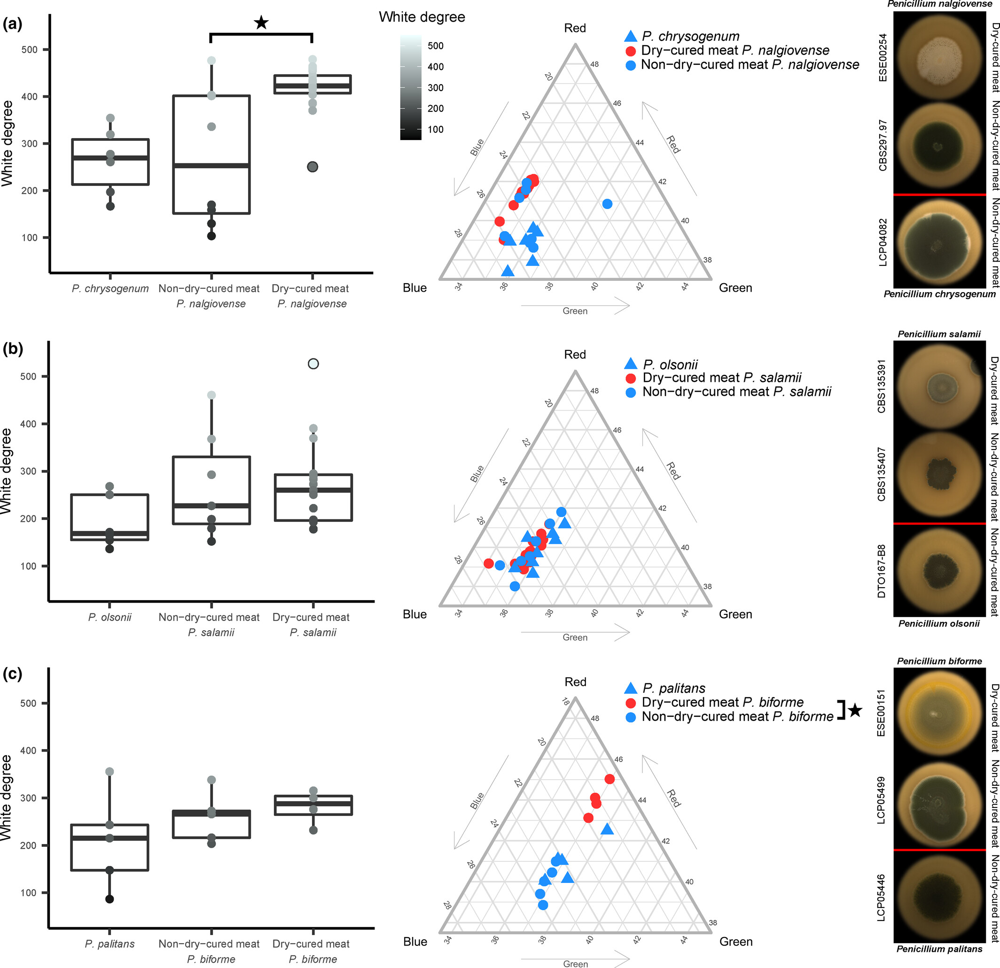
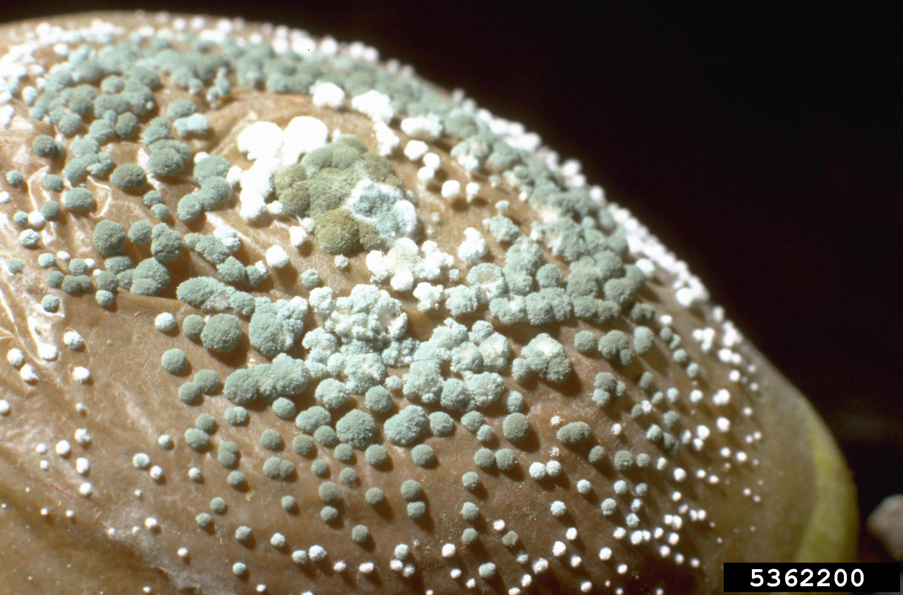
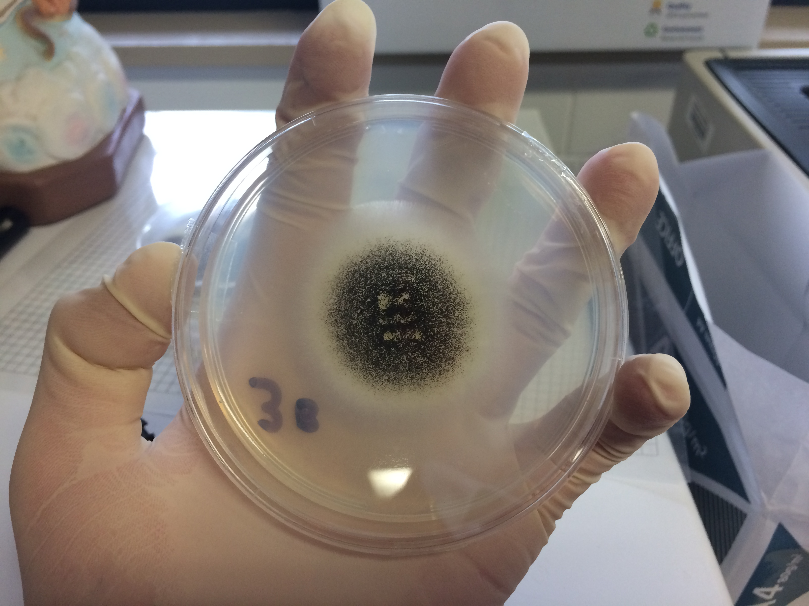
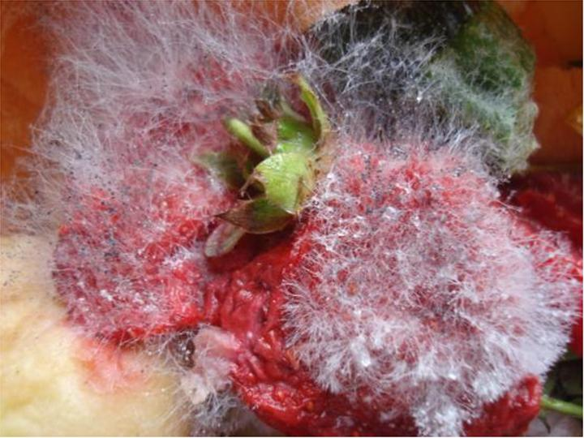

# Runbook — Moho indeseado

**Síntoma**: mohos verdes, negros, azulados o peludos en la superficie durante
maduración. Distinto del moho blanco/gris deseado (*Penicillium nalgiovense* y
similares) que forma una capa fina y aterciopelada.

## Clasificación rápida

| Aspecto | Interpretación | Acción |
|---|---|---|
| Blanco/gris, fino, seco | Flora deseada | Ninguna |
| Verde intenso | *Penicillium* toxigénico posible | Retirar / descartar |
| Negro | *Cladosporium* / *Aspergillus* | Descartar |
| Peludo, húmedo | Exceso de HR + poca ventilación | Corregir cámara |

## Fotos de referencia

Las imágenes viven en `vault/runbooks/attachments/`. Se irán agregando a
medida que aparezcan casos reales en el taller (ver
[[attachments/README|convenciones de attachments]] para nombre, escala y
formato).

### Deseado — velo blanco parejo (*P. nalgiovense*)

> Colonias de *P. nalgiovense* (y especies afines de embutidos curados) sobre
> agar extracto de malta: velo blanco parejo, aterciopelado, sin manchas de
> color. Es lo que buscamos: ocupa el nicho e inhibe a los indeseados.
> Referencia visual, no foto del taller. Crédito: Lo, Y.-C. et al. (2023),
> CC BY 4.0 — ver `attachments/README.md`.

### Indeseado — verde (*Penicillium* verde)

> *P. expansum* en primer plano: esporas verde-azuladas, pulverulentas, con
> el halo típico. Aparece con HR excesiva o ventilación insuficiente. Riesgo
> de micotoxinas → descartar la pieza si está extendido o penetrante.
> Foto sobre fruta (no salame), sirve como referencia de aspecto y color.
> Crédito: H.J. Larsen, Bugwood.org, CC BY 3.0 US.

### Indeseado — negro (*Cladosporium* / *Aspergillus niger*)

> Colonia de *A. niger* sobre agar patata-dextrosa: esporulación negra
> pulverulenta muy característica. Sobre corteza de embutido aparece como
> manchas negras secas o algo grasas, en zonas de condensación o humedad
> alta. Descartar la pieza; revisar cámara y ver [[higiene-desinfeccion]].
> Crédito: Saxon Vinkovic, CC BY-SA 4.0.

### Indeseado — peludo largo (mucor / rhizopus)

> *Rhizopus stolonifer*: filamentos largos, algodonosos, blanco-grisáceos,
> con esporangios negros en los extremos. Sobre embutido delata HR alta y
> aire estancado. Corregir cámara y evaluar pieza a pieza.
> Crédito: Eric McKenzie / PaDIL, CC BY 3.0 AU.

> Fotografiar con fondo neutro, luz difusa y regla/moneda para escala. Ver
> convenciones en `vault/runbooks/attachments/README.md`.

## Acción

1. **Aislar** la pieza afectada de las sanas.
2. Moho superficial leve y localizado: cepillar/frotar con salmuera o vinagre.
3. Moho verde/negro extendido o penetrante: **descartar la pieza** (micotoxinas
   difunden al interior, no basta con limpiar la corteza).
4. Revisar cámara: bajar HR a 78–82 %, mejorar circulación de aire, limpiar y
   desinfectar superficies (ver [[higiene-desinfeccion]]).

## Prevención

- Inóculo de moho noble en superficie para ocupar el nicho (competencia — es una
  de las barreras de [[barreras-control]]).
- HR y ventilación según [[Procedimiento-embutido]] paso 6.
- Evitar bolsas de aire y condensación; no amontonar piezas.

Relacionado: [[case-hardening]]

